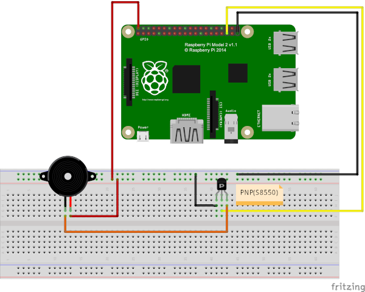
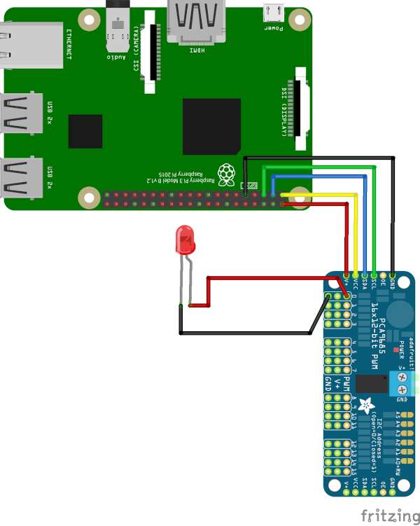
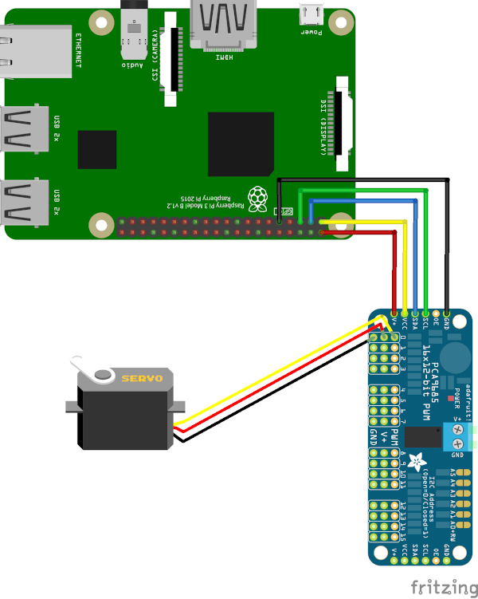

# **Learning to play the Piano with a Python Bot**

## **AUTHOR**

* Manel Lurbe Sempere (malursem@inf.upv.es)

## **ABSTRACT**

<p align=justify>
This project is based on my interest in learning to play the piano in my spare time. As everyone knows, learning to play an instrument is difficult and requires a lot of time and dedication. In my case, I am a computer engineer and for lack of time I decided to start a project to start playing the piano using a software guide implemented with LED lights on each piano key. My interest in this software has increased throughout the development and has ended up becoming a bot that plays the piano.
</p>

## **PROGRAMS OF THIS PROJECT**

### PIANO PLAYING BOT

- Program *pianoPlayPi.py* is the program to play with Servo motors.
- Folder  *partitures* contains example music sheets to play with previous program.

### VIRTUAL PIANO

- Program *buzzerPi.py* is a program to play songs with a passive buzzer using the frequencies of piano notes. To play multiple notes at the same time you need as many as notes are wanted to play at the same time.

### LEARNING TO PLAY THE PIANO

- Program *ledPi.py* is a program to learn to play the piano using a servo controller for switching LEDs, each LED corresponds to one note, you need as many LEDs as notes are wanted to play. 
- This program was the first implementation and was designed to learn to play the piano by placing a LED on top of each key to play it every time a LED was turned on.

**GOOGLE ASSISTANT SUPPORT**

 The bot can be executed from google assistant, creating commands from a google account and linking the controller device as a home IoT device to launch orders such as: "OK Google, play Bethoven's Fifth Symphony on the piano".

## **DOCUMENTATION AND SET UP**

### **SOFTWARE REQUISITES**

- Install python3 for develop (Ubuntu/Debian based systems):

    ```sudo apt install python3-dev python3-pip python3-tk build-essential libi2c-dev i2c-tools libffi-dev```

- Install libs for python 3:

    ```sudo python3 -m pip install adafruit-circuitpython-busdevice adafruit-circuitpython-servokit adafruit-circuitpython-pca9685 PCA9685-driver RPi.GPIO```

### **HARDWARE REQUISITES**

- Raspberry Pi (any model) or other similar board with support of GPIO ports and python3. [Buy on amazon](https://www.amazon.es/s?k=raspberry+pi&__mk_es_ES=%C3%85M%C3%85%C5%BD%C3%95%C3%91&ref=nb_sb_noss_1)
- Cables to connect anything with the GPIO ports. [Buy on amazon](https://www.amazon.es/Neuftech-20cm-jumper-Arduino-Breadboard/dp/B00NBO4F76/ref=sr_1_2?__mk_es_ES=%C3%85M%C3%85%C5%BD%C3%95%C3%91&keywords=gpio+cable+raspberry&qid=1582485107&s=toys&sr=1-2-catcorr)

If you want to play *pianoPlayPi.py* program you need:

- Servo motors as many as notes you want to play. [Buy on amazon](https://www.amazon.es/gp/product/B07MPPF5CS/ref=ppx_yo_dt_b_asin_title_o01_s00?ie=UTF8&psc=1)
- PCA9685 16 Channel PWM Servo Driver, more than one if you want to support more than 16 servos at the same time. [Buy on amazon](https://www.amazon.es/gp/product/B014KTSMLA/ref=ppx_yo_dt_b_asin_title_o08_s00?ie=UTF8&psc=1)

If you want to play *buzzerPi.py* program you need:

- As many passive Buzzers as notes you want to play at the same time. [Buy on amazon](https://www.amazon.es/Passive-Buzzer-Module-Control-Arduino/dp/B07P5YKR8S/ref=sr_1_2?__mk_es_ES=%C3%85M%C3%85%C5%BD%C3%95%C3%91&keywords=passive+buzzer&qid=1583053896&sr=8-2)

If you want to play *ledPi.py* program you need:

- LEDs, as many as notes you want to play. [Buy on amazon](https://www.amazon.es/dp/B07YPVLH27/ref=sspa_dk_detail_8?psc=1&pd_rd_i=B07YPVLH27&pd_rd_w=ZUv4F&pf_rd_p=f0815c89-d195-4bd5-89fe-99dc61984993&pd_rd_wg=pqCwO&pf_rd_r=BCAXW1483VFR14S1M305&pd_rd_r=e580d14e-615a-49de-9f68-84a940f775f5&spLa=ZW5jcnlwdGVkUXVhbGlmaWVyPUEzSUk2UFJaSkpSN0lKJmVuY3J5cHRlZElkPUEwODU0MjU3MU1LNDJXMjI3NEU3VSZlbmNyeXB0ZWRBZElkPUEwNjA3MTUwM0NOS1I3RjQ2RzE5NSZ3aWRnZXROYW1lPXNwX2RldGFpbCZhY3Rpb249Y2xpY2tSZWRpcmVjdCZkb05vdExvZ0NsaWNrPXRydWU=)

### **SET UP HARDWARE CONNECTIONS**

- buzzerPi.py:



- ledPi.py:



- pianoPlayPi.py:



### **HOW TO USE**

- Set execution permissions:

    ```chmod +x program.py```

- Usage:

     ```python3 program.py partitures/partiture.txt```

     or:

    ```./program.py partitures/partiture.txt```

**NOTE: Replace program with the name of the program you want to execute and partiture with the name of the song you want to play from the folder "partitures".**

- ONLY IN *pianoPlayPi.pay* FOR DUAL HAND EMULATION WITH THREADS:

     ```python3 pianoPlayPi.py partitures/partiture_hand_1.txt partitures/partiture_hand_2.txt```

     or:

    ```./pianoPlayPi.py partitures/partiture_hand_1.txt partitures/partiture_hand_2.txt```

**NOTE: Music sheets for dual hand as in real life shouldn't contains the same notes at the same time, there is no reason to play with two hands the same notes.**

### **MUSIC SHEETS**

<p align=justify>
I'm trying to find a lib or website that provides music sheets in plain text for bots or in more complex way, develop a machine learning algorithm to recognise notes in pdf or image based music sheets. The idea is to give to the piano bot the capacity of play any kind of song without having to rewrite it again specifically for him.
</p>

#### STYLE

Music Sheets for the piano are composed by a file of tuples (note,tempo), where "note" corresponds to the music note to be played and "tempo" the type of the note represented in the following table:

<table style="border:1px solid black;margin-left:auto;margin-right:auto;">
<tbody>
    <tr>
        <th>Music symbols</th>
        <th>Code Style</th>
    </tr>
    <tr>
        <td>&#119133;&#119133;</td>
        <td>dr</td>
    </tr>
    <tr>
        <td>&#119133;</td>
        <td>r</td>
    </tr>
    <tr>
        <td>&#119134;.</td>
        <td>b+</td>
    </tr>
    <tr>
        <td>&#119134;&#119136;</td>
        <td>b-</td>
    </tr>
    <tr>
        <td>&#119134;</td>
        <td>b</td>
    </tr>
    <tr>
        <td>&#119135;.</td>
        <td>n+</td>
    </tr>
    <tr>
        <td>&#119135;&#119136;</td>
        <td>n-</td>
    </tr>
    <tr>
        <td>&#119135;</td>
        <td>n</td>
    </tr>
    <tr>
        <td>&#119136;</td>
        <td>c</td>
    </tr>
    <tr>
        <td>&#119137;</td>
        <td>sc</td>
    </tr>
    <tr>
        <td>&#119139;</td>
        <td>ssc</td>
    </tr>
    <tr>
        <td>&#119140;</td>
        <td>sssc</td>
    </tr>
    <tr>
        <td>&#9837;</td>
        <td><i>*Write "b" after the note. Example: "mib" corresponds to note "mi flat".*<i></td>
    </tr>
    <tr>
        <td>&#9839;</td>
        <td><i>*Translate it to flats.*<i></td>
    </tr>
    <tr>
        <td>Silence</td>
        <td><i>*Same as the type of the note tempo. Example: "(sil,n)" corresponds to silence with the tempo of quarter note( &#119135; ).*<i></td>
    </tr>
</tbody>
</table>

In addition, you can play two or more notes at the same time if they have the same tempo in the same thread, separating them with a tab (\t) key value. The file will be like this:

- For one note:

    ```
    do,n
    re,n
    mi,n
    fa,n
    sol,n
    la,n
    si,n
    do2,n

- For two (or more) notes with same tempo:

    ```
    do,n    do2,n
    re,n    si,n
    mi,n    la,n
    fa,n    sol,n
    sol,n   fa,n
    la,n    mi,n
    si,n    re,n
    do2,n   do,n

### **PIANO FREQUENCIES**

<table style="border:1px solid black;margin-left:auto;margin-right:auto;">
    <tbody><tr>
        <th>Key Number</th>
        <th>Franco-Belgian notation</th>
        <th>Anglo-Saxon notation</th>
        <th>Frecuency</th>
    </tr>
    <tr>
    <td bgcolor="white">88</td>
    <td><i>do<sub>7</sub></i></td>
    <td>C8</td>
    <td>4186,01
    </td></tr>
    <tr>
    <td bgcolor="white">87</td>
    <td><i>si<sub>6</sub></i></td>
    <td>B7</td>
    <td>3951,07
    </td></tr>
    <tr>
    <td bgcolor="black" style="color:white">86</td>
    <td><i>la<span class="music-symbol" style="font-family: Arial Unicode MS, Lucida Sans Unicode;">♯</span><sub>6</sub></i>/<i>si<span class="music-symbol" style="font-family: Arial Unicode MS, Lucida Sans Unicode;">♭</span><sub>6</sub></i></td>
    <td>A<span class="music-symbol" style="font-family: Arial Unicode MS, Lucida Sans Unicode;">♯</span>7/B<span class="music-symbol" style="font-family: Arial Unicode MS, Lucida Sans Unicode;">♭</span>7</td>
    <td>3729,31
    </td></tr>
    <tr>
    <td bgcolor="white">85</td>
    <td><i>la<sub>6</sub></i></td>
    <td>A7</td>
    <td>3520,00
    </td></tr>
    <tr>
    <td bgcolor="black" style="color:white">84</td>
    <td><i>sol<span class="music-symbol" style="font-family: Arial Unicode MS, Lucida Sans Unicode;">♯</span><sub>6</sub></i>/<i>la<span class="music-symbol" style="font-family: Arial Unicode MS, Lucida Sans Unicode;">♭</span><sub>6</sub></i></td>
    <td>G<span class="music-symbol" style="font-family: Arial Unicode MS, Lucida Sans Unicode;">♯</span>7/A<span class="music-symbol" style="font-family: Arial Unicode MS, Lucida Sans Unicode;">♭</span>7</td>
    <td>3322,44
    </td></tr>
    <tr>
    <td bgcolor="white">83</td>
    <td><i>sol<sub>6</sub></i></td>
    <td>G7</td>
    <td>3135,96
    </td></tr>
    <tr>
    <td bgcolor="black" style="color:white">82</td>
    <td><i>fa<span class="music-symbol" style="font-family: Arial Unicode MS, Lucida Sans Unicode;">♯</span><sub>6</sub></i>/<i>sol<span class="music-symbol" style="font-family: Arial Unicode MS, Lucida Sans Unicode;">♭</span><sub>6</sub></i></td>
    <td>F<span class="music-symbol" style="font-family: Arial Unicode MS, Lucida Sans Unicode;">♯</span>7/G<span class="music-symbol" style="font-family: Arial Unicode MS, Lucida Sans Unicode;">♭</span>7</td>
    <td>2959,96
    </td></tr>
    <tr>
    <td bgcolor="white">81</td>
    <td><i>fa<sub>6</sub></i></td>
    <td>F7</td>
    <td>2793,83
    </td></tr>
    <tr>
    <td bgcolor="white">80</td>
    <td><i>mi<sub>6</sub></i></td>
    <td>E7</td>
    <td>2637,02
    </td></tr>
    <tr>
    <td bgcolor="black" style="color:white">79</td>
    <td><i>re<span class="music-symbol" style="font-family: Arial Unicode MS, Lucida Sans Unicode;">♯</span><sub>6</sub></i>/<i>mi<span class="music-symbol" style="font-family: Arial Unicode MS, Lucida Sans Unicode;">♭</span><sub>6</sub></i></td>
    <td>D<span class="music-symbol" style="font-family: Arial Unicode MS, Lucida Sans Unicode;">♯</span>7/E<span class="music-symbol" style="font-family: Arial Unicode MS, Lucida Sans Unicode;">♭</span>7</td>
    <td>2489,02
    </td></tr>
    <tr>
    <td bgcolor="white">78</td>
    <td><i>re<sub>6</sub></i></td>
    <td>D7</td>
    <td>2349,32
    </td></tr>
    <tr>
    <td bgcolor="black" style="color:white">77</td>
    <td><i>do<span class="music-symbol" style="font-family: Arial Unicode MS, Lucida Sans Unicode;">♯</span><sub>6</sub></i>/<i>re<span class="music-symbol" style="font-family: Arial Unicode MS, Lucida Sans Unicode;">♭</span><sub>6</sub></i></td>
    <td>C<span class="music-symbol" style="font-family: Arial Unicode MS, Lucida Sans Unicode;">♯</span>7/D<span class="music-symbol" style="font-family: Arial Unicode MS, Lucida Sans Unicode;">♭</span>7</td>
    <td>2217,46
    </td></tr>
    <tr>
    <td bgcolor="white">76</td>
    <td><i>do<sub>6</sub></i></td>
    <td>C7</td>
    <td>2093,00
    </td></tr>
    <tr>
    <td bgcolor="white">75</td>
    <td><i>si<sub>5</sub></i></td>
    <td>B6</td>
    <td>1975,53
    </td></tr>
    <tr>
    <td bgcolor="black" style="color:white">74</td>
    <td><i>la<span class="music-symbol" style="font-family: Arial Unicode MS, Lucida Sans Unicode;">♯</span><sub>5</sub></i>/<i>si<span class="music-symbol" style="font-family: Arial Unicode MS, Lucida Sans Unicode;">♭</span><sub>5</sub></i></td>
    <td>A<span class="music-symbol" style="font-family: Arial Unicode MS, Lucida Sans Unicode;">♯</span>6/B<span class="music-symbol" style="font-family: Arial Unicode MS, Lucida Sans Unicode;">♭</span>6</td>
    <td>1864,66
    </td></tr>
    <tr>
    <td bgcolor="white">73</td>
    <td><i>la<sub>5</sub></i></td>
    <td>A6</td>
    <td>1760,00
    </td></tr>
    <tr>
    <td bgcolor="black" style="color:white">72</td>
    <td><i>sol<span class="music-symbol" style="font-family: Arial Unicode MS, Lucida Sans Unicode;">♯</span><sub>5</sub></i>/<i>la<span class="music-symbol" style="font-family: Arial Unicode MS, Lucida Sans Unicode;">♭</span><sub>5</sub></i></td>
    <td>G<span class="music-symbol" style="font-family: Arial Unicode MS, Lucida Sans Unicode;">♯</span>6/A<span class="music-symbol" style="font-family: Arial Unicode MS, Lucida Sans Unicode;">♭</span>6</td>
    <td>1661,22
    </td></tr>
    <tr>
    <td bgcolor="white">71</td>
    <td><i>sol<sub>5</sub></i></td>
    <td>G6</td>
    <td>1567,98
    </td></tr>
    <tr>
    <td bgcolor="black" style="color:white">70</td>
    <td><i>fa<span class="music-symbol" style="font-family: Arial Unicode MS, Lucida Sans Unicode;">♯</span><sub>5</sub></i>/<i>sol<span class="music-symbol" style="font-family: Arial Unicode MS, Lucida Sans Unicode;">♭</span><sub>5</sub></i></td>
    <td>F<span class="music-symbol" style="font-family: Arial Unicode MS, Lucida Sans Unicode;">♯</span>6/G<span class="music-symbol" style="font-family: Arial Unicode MS, Lucida Sans Unicode;">♭</span>6</td>
    <td>1479,98
    </td></tr>
    <tr>
    <td bgcolor="white">69</td>
    <td><i>fa<sub>5</sub></i></td>
    <td>F6</td>
    <td>1396,91
    </td></tr>
    <tr>
    <td bgcolor="white">68</td>
    <td><i>mi<sub>5</sub></i></td>
    <td>E6</td>
    <td>1318,51
    </td></tr>
    <tr>
    <td bgcolor="black" style="color:white">67</td>
    <td><i>re<span class="music-symbol" style="font-family: Arial Unicode MS, Lucida Sans Unicode;">♯</span><sub>5</sub></i>/<i>mi<span class="music-symbol" style="font-family: Arial Unicode MS, Lucida Sans Unicode;">♭</span><sub>5</sub></i></td>
    <td>D<span class="music-symbol" style="font-family: Arial Unicode MS, Lucida Sans Unicode;">♯</span>6/E<span class="music-symbol" style="font-family: Arial Unicode MS, Lucida Sans Unicode;">♭</span>6</td>
    <td>1244,51
    </td></tr>
    <tr>
    <td bgcolor="white">66</td>
    <td><i>re<sub>5</sub></i></td>
    <td>D6</td>
    <td>1174,66
    </td></tr>
    <tr>
    <td bgcolor="black" style="color:white">65</td>
    <td><i>do<span class="music-symbol" style="font-family: Arial Unicode MS, Lucida Sans Unicode;">♯</span><sub>5</sub></i>/<i>re<span class="music-symbol" style="font-family: Arial Unicode MS, Lucida Sans Unicode;">♭</span><sub>5</sub></i></td>
    <td>C<span class="music-symbol" style="font-family: Arial Unicode MS, Lucida Sans Unicode;">♯</span>6/D<span class="music-symbol" style="font-family: Arial Unicode MS, Lucida Sans Unicode;">♭</span>6</td>
    <td>1108,73
    </td></tr>
    <tr>
    <td bgcolor="white">64</td>
    <td><i>do<sub>5</sub></i></td>
    <td>C6</td>
    <td>1046,50
    </td></tr>
    <tr>
    <td bgcolor="white">63</td>
    <td><i>si<sub>4</sub></i></td>
    <td>B5</td>
    <td>987,767
    </td></tr>
    <tr>
    <td bgcolor="black" style="color:white">62</td>
    <td><i>la<span class="music-symbol" style="font-family: Arial Unicode MS, Lucida Sans Unicode;">♯</span><sub>4</sub></i>/<i>si<span class="music-symbol" style="font-family: Arial Unicode MS, Lucida Sans Unicode;">♭</span><sub>4</sub></i></td>
    <td>A<span class="music-symbol" style="font-family: Arial Unicode MS, Lucida Sans Unicode;">♯</span>5/B<span class="music-symbol" style="font-family: Arial Unicode MS, Lucida Sans Unicode;">♭</span>5</td>
    <td>932,328
    </td></tr>
    <tr>
    <td bgcolor="white">61</td>
    <td><i>la<sub>4</sub></i></td>
    <td>A5</td>
    <td>880,000
    </td></tr>
    <tr>
    <td bgcolor="black" style="color:white">60</td>
    <td><i>sol<span class="music-symbol" style="font-family: Arial Unicode MS, Lucida Sans Unicode;">♯</span><sub>4</sub></i>/<i>la<span class="music-symbol" style="font-family: Arial Unicode MS, Lucida Sans Unicode;">♭</span><sub>4</sub></i></td>
    <td>G<span class="music-symbol" style="font-family: Arial Unicode MS, Lucida Sans Unicode;">♯</span>5/A<span class="music-symbol" style="font-family: Arial Unicode MS, Lucida Sans Unicode;">♭</span>5</td>
    <td>830,609
    </td></tr>
    <tr>
    <td bgcolor="white">59</td>
    <td><i>sol<sub>4</sub></i></td>
    <td>G5</td>
    <td>783,991
    </td></tr>
    <tr>
    <td bgcolor="black" style="color:white">58</td>
    <td><i>fa<span class="music-symbol" style="font-family: Arial Unicode MS, Lucida Sans Unicode;">♯</span><sub>4</sub></i>/<i>sol<span class="music-symbol" style="font-family: Arial Unicode MS, Lucida Sans Unicode;">♭</span><sub>4</sub></i></td>
    <td>F<span class="music-symbol" style="font-family: Arial Unicode MS, Lucida Sans Unicode;">♯</span>5/G<span class="music-symbol" style="font-family: Arial Unicode MS, Lucida Sans Unicode;">♭</span>5</td>
    <td>739,989
    </td></tr>
    <tr>
    <td bgcolor="white">57</td>
    <td><i>fa<sub>4</sub></i></td>
    <td>F5</td>
    <td>698,456
    </td></tr>
    <tr>
    <td bgcolor="white">56</td>
    <td><i>mi<sub>4</sub></i></td>
    <td>E5</td>
    <td>659,255
    </td></tr>
    <tr>
    <td bgcolor="black" style="color:white">55</td>
    <td><i>re<span class="music-symbol" style="font-family: Arial Unicode MS, Lucida Sans Unicode;">♯</span><sub>4</sub></i>/<i>mi<span class="music-symbol" style="font-family: Arial Unicode MS, Lucida Sans Unicode;">♭</span><sub>4</sub></i></td>
    <td>D<span class="music-symbol" style="font-family: Arial Unicode MS, Lucida Sans Unicode;">♯</span>5/E<span class="music-symbol" style="font-family: Arial Unicode MS, Lucida Sans Unicode;">♭</span>5</td>
    <td>622,254
    </td></tr>
    <tr>
    <td bgcolor="white">54</td>
    <td><i>re<sub>4</sub></i></td>
    <td>D5</td>
    <td>587,330
    </td></tr>
    <tr>
    <td bgcolor="black" style="color:white">53</td>
    <td><i>do<span class="music-symbol" style="font-family: Arial Unicode MS, Lucida Sans Unicode;">♯</span><sub>4</sub></i>/<i>re<span class="music-symbol" style="font-family: Arial Unicode MS, Lucida Sans Unicode;">♭</span><sub>4</sub></i></td>
    <td>C<span class="music-symbol" style="font-family: Arial Unicode MS, Lucida Sans Unicode;">♯</span>5/D<span class="music-symbol" style="font-family: Arial Unicode MS, Lucida Sans Unicode;">♭</span>5</td>
    <td>554,365
    </td></tr>
    <tr>
    <td bgcolor="white">52</td>
    <td><i>do<sub>4</sub></i></td>
    <td>C5</td>
    <td>523,251
    </td></tr>
    <tr>
    <td bgcolor="white">51</td>
    <td><i>si<sub>3</sub></i></td>
    <td>B4</td>
    <td>493,883
    </td></tr>
    <tr>
    <td bgcolor="black" style="color:white">50</td>
    <td><i>la<span class="music-symbol" style="font-family: Arial Unicode MS, Lucida Sans Unicode;">♯</span><sub>3</sub></i>/<i>si<span class="music-symbol" style="font-family: Arial Unicode MS, Lucida Sans Unicode;">♭</span><sub>3</sub></i></td>
    <td>A<span class="music-symbol" style="font-family: Arial Unicode MS, Lucida Sans Unicode;">♯</span>4/B<span class="music-symbol" style="font-family: Arial Unicode MS, Lucida Sans Unicode;">♭</span>4</td>
    <td>466,164
    </td></tr>
    <tr>
    <td bgcolor="white">49</td>
    <td><i>la<sub>3</sub></i></td>
    <td>A4</td>
    <td bgcolor="yellow">440,000
    </td></tr>
    <tr>
    <td bgcolor="black" style="color:white">48</td>
    <td><i>sol<span class="music-symbol" style="font-family: Arial Unicode MS, Lucida Sans Unicode;">♯</span><sub>3</sub></i>/<i>la<span class="music-symbol" style="font-family: Arial Unicode MS, Lucida Sans Unicode;">♭</span><sub>3</sub></i></td>
    <td>G<span class="music-symbol" style="font-family: Arial Unicode MS, Lucida Sans Unicode;">♯</span>4/A<span class="music-symbol" style="font-family: Arial Unicode MS, Lucida Sans Unicode;">♭</span>4</td>
    <td>415,305
    </td></tr>
    <tr>
    <td bgcolor="white">47</td>
    <td><i>sol<sub>3</sub></i></td>
    <td>G4</td>
    <td>391,995
    </td></tr>
    <tr>
    <td bgcolor="black" style="color:white">46</td>
    <td><i>fa<span class="music-symbol" style="font-family: Arial Unicode MS, Lucida Sans Unicode;">♯</span><sub>3</sub></i>/<i>sol<span class="music-symbol" style="font-family: Arial Unicode MS, Lucida Sans Unicode;">♭</span><sub>3</sub></i></td>
    <td>F<span class="music-symbol" style="font-family: Arial Unicode MS, Lucida Sans Unicode;">♯</span>4/G<span class="music-symbol" style="font-family: Arial Unicode MS, Lucida Sans Unicode;">♭</span>4</td>
    <td>369,994
    </td></tr>
    <tr>
    <td bgcolor="white">45</td>
    <td><i>fa<sub>3</sub></i></td>
    <td>F4</td>
    <td>349,228
    </td></tr>
    <tr>
    <td bgcolor="white">44</td>
    <td><i>mi<sub>3</sub></i></td>
    <td>E4</td>
    <td>329,628
    </td></tr>
    <tr>
    <td bgcolor="black" style="color:white">43</td>
    <td><i>re<span class="music-symbol" style="font-family: Arial Unicode MS, Lucida Sans Unicode;">♯</span><sub>3</sub></i>/<i>mi<span class="music-symbol" style="font-family: Arial Unicode MS, Lucida Sans Unicode;">♭</span><sub>3</sub></i></td>
    <td>D<span class="music-symbol" style="font-family: Arial Unicode MS, Lucida Sans Unicode;">♯</span>4/E<span class="music-symbol" style="font-family: Arial Unicode MS, Lucida Sans Unicode;">♭</span>4</td>
    <td>311,127
    </td></tr>
    <tr>
    <td bgcolor="white">42</td>
    <td><i>re<sub>3</sub></i></td>
    <td>D4</td>
    <td>293,665
    </td></tr>
    <tr>
    <td bgcolor="black" style="color:white">41</td>
    <td><i>do<span class="music-symbol" style="font-family: Arial Unicode MS, Lucida Sans Unicode;">♯</span><sub>3</sub></i>/<i>re<span class="music-symbol" style="font-family: Arial Unicode MS, Lucida Sans Unicode;">♭</span><sub>3</sub></i></td>
    <td>C<span class="music-symbol" style="font-family: Arial Unicode MS, Lucida Sans Unicode;">♯</span>4/D<span class="music-symbol" style="font-family: Arial Unicode MS, Lucida Sans Unicode;">♭</span>4</td>
    <td>277,183
    </td></tr>
    <tr>
    <td bgcolor="white">40</td>
    <td><i>do<sub>3</sub></i></td>
    <td>C4 <b>(central do)</b></td>
    <td bgcolor="skyblue">261,626
    </td></tr>
    <tr>
    <td bgcolor="white">39</td>
    <td><i>si<sub>2</sub></i></td>
    <td>B3</td>
    <td>246,942
    </td></tr>
    <tr>
    <td bgcolor="black" style="color:white">38</td>
    <td><i>la<span class="music-symbol" style="font-family: Arial Unicode MS, Lucida Sans Unicode;">♯</span><sub>2</sub></i>/<i>si<span class="music-symbol" style="font-family: Arial Unicode MS, Lucida Sans Unicode;">♭</span><sub>2</sub></i></td>
    <td>A<span class="music-symbol" style="font-family: Arial Unicode MS, Lucida Sans Unicode;">♯</span>3/B<span class="music-symbol" style="font-family: Arial Unicode MS, Lucida Sans Unicode;">♭</span>3</td>
    <td>233,082
    </td></tr>
    <tr>
    <td bgcolor="white">37</td>
    <td><i>la<sub>2</sub></i></td>
    <td>A3</td>
    <td>220,000
    </td></tr>
    <tr>
    <td bgcolor="black" style="color:white">36</td>
    <td><i>sol<span class="music-symbol" style="font-family: Arial Unicode MS, Lucida Sans Unicode;">♯</span><sub>2</sub></i>/<i>la<span class="music-symbol" style="font-family: Arial Unicode MS, Lucida Sans Unicode;">♭</span><sub>2</sub></i></td>
    <td>G<span class="music-symbol" style="font-family: Arial Unicode MS, Lucida Sans Unicode;">♯</span>3/A<span class="music-symbol" style="font-family: Arial Unicode MS, Lucida Sans Unicode;">♭</span>3</td>
    <td>207,652
    </td></tr>
    <tr>
    <td bgcolor="white">35</td>
    <td><i>sol<sub>2</sub></i></td>
    <td>G3</td>
    <td>195,998
    </td></tr>
    <tr>
    <td bgcolor="black" style="color:white">34</td>
    <td><i>fa<span class="music-symbol" style="font-family: Arial Unicode MS, Lucida Sans Unicode;">♯</span><sub>2</sub></i>/<i>sol<span class="music-symbol" style="font-family: Arial Unicode MS, Lucida Sans Unicode;">♭</span><sub>2</sub></i></td>
    <td>F<span class="music-symbol" style="font-family: Arial Unicode MS, Lucida Sans Unicode;">♯</span>3/G<span class="music-symbol" style="font-family: Arial Unicode MS, Lucida Sans Unicode;">♭</span>3</td>
    <td>184,997
    </td></tr>
    <tr>
    <td bgcolor="white">33</td>
    <td><i>fa<sub>2</sub></i></td>
    <td>F3</td>
    <td>174,614
    </td></tr>
    <tr>
    <td bgcolor="white">32</td>
    <td><i>mi<sub>2</sub></i></td>
    <td>E3</td>
    <td>164,814
    </td></tr>
    <tr>
    <td bgcolor="black" style="color:white">31</td>
    <td><i>re<span class="music-symbol" style="font-family: Arial Unicode MS, Lucida Sans Unicode;">♯</span><sub>2</sub></i>/<i>mi<span class="music-symbol" style="font-family: Arial Unicode MS, Lucida Sans Unicode;">♭</span><sub>2</sub></i></td>
    <td>D<span class="music-symbol" style="font-family: Arial Unicode MS, Lucida Sans Unicode;">♯</span>3/E<span class="music-symbol" style="font-family: Arial Unicode MS, Lucida Sans Unicode;">♭</span>3</td>
    <td>155,563
    </td></tr>
    <tr>
    <td bgcolor="white">30</td>
    <td><i>re<sub>2</sub></i></td>
    <td>D3</td>
    <td>146,832
    </td></tr>
    <tr>
    <td bgcolor="black" style="color:white">29</td>
    <td><i>do<span class="music-symbol" style="font-family: Arial Unicode MS, Lucida Sans Unicode;">♯</span><sub>2</sub></i>/<i>re<span class="music-symbol" style="font-family: Arial Unicode MS, Lucida Sans Unicode;">♭</span><sub>2</sub></i></td>
    <td>C<span class="music-symbol" style="font-family: Arial Unicode MS, Lucida Sans Unicode;">♯</span>3/D<span class="music-symbol" style="font-family: Arial Unicode MS, Lucida Sans Unicode;">♭</span>3</td>
    <td>138,591
    </td></tr>
    <tr>
    <td bgcolor="white">28</td>
    <td><i>do<sub>2</sub></i></td>
    <td>C3</td>
    <td>130,813
    </td></tr>
    <tr>
    <td bgcolor="white">27</td>
    <td><i>si<sub>1</sub></i></td>
    <td>B2</td>
    <td>123,471
    </td></tr>
    <tr>
    <td bgcolor="black" style="color:white">26</td>
    <td><i>la<span class="music-symbol" style="font-family: Arial Unicode MS, Lucida Sans Unicode;">♯</span><sub>1</sub></i>/<i>si<span class="music-symbol" style="font-family: Arial Unicode MS, Lucida Sans Unicode;">♭</span><sub>1</sub></i></td>
    <td>A<span class="music-symbol" style="font-family: Arial Unicode MS, Lucida Sans Unicode;">♯</span>2/B<span class="music-symbol" style="font-family: Arial Unicode MS, Lucida Sans Unicode;">♭</span>2</td>
    <td>116,541
    </td></tr>
    <tr>
    <td bgcolor="white">25</td>
    <td><i>la<sub>1</sub></i></td>
    <td>A2</td>
    <td>110,000
    </td></tr>
    <tr>
    <td bgcolor="black" style="color:white">24</td>
    <td><i>sol<span class="music-symbol" style="font-family: Arial Unicode MS, Lucida Sans Unicode;">♯</span><sub>1</sub></i>/<i>la<span class="music-symbol" style="font-family: Arial Unicode MS, Lucida Sans Unicode;">♭</span><sub>1</sub></i></td>
    <td>G<span class="music-symbol" style="font-family: Arial Unicode MS, Lucida Sans Unicode;">♯</span>2/A<span class="music-symbol" style="font-family: Arial Unicode MS, Lucida Sans Unicode;">♭</span>2</td>
    <td>103,826
    </td></tr>
    <tr>
    <td bgcolor="white">23</td>
    <td><i>sol<sub>1</sub></i></td>
    <td>G2</td>
    <td>97,9989
    </td></tr>
    <tr>
    <td bgcolor="black" style="color:white">22</td>
    <td><i>fa<span class="music-symbol" style="font-family: Arial Unicode MS, Lucida Sans Unicode;">♯</span><sub>1</sub></i>/<i>sol<span class="music-symbol" style="font-family: Arial Unicode MS, Lucida Sans Unicode;">♭</span> <sub>1</sub></i></td>
    <td>F<span class="music-symbol" style="font-family: Arial Unicode MS, Lucida Sans Unicode;">♯</span>2/G<span class="music-symbol" style="font-family: Arial Unicode MS, Lucida Sans Unicode;">♭</span>2</td>
    <td>92,4986
    </td></tr>
    <tr>
    <td bgcolor="white">21</td>
    <td><i>fa<sub>1</sub></i></td>
    <td>F2</td>
    <td>87,3071
    </td></tr>
    <tr>
    <td bgcolor="white">20</td>
    <td><i>mi<sub>1</sub></i></td>
    <td>E2</td>
    <td>82,4069
    </td></tr>
    <tr>
    <td bgcolor="black" style="color:white">19</td>
    <td><i>re<span class="music-symbol" style="font-family: Arial Unicode MS, Lucida Sans Unicode;">♯</span><sub>1</sub></i>/<i>mi<span class="music-symbol" style="font-family: Arial Unicode MS, Lucida Sans Unicode;">♭</span><sub>1</sub></i></td>
    <td>D<span class="music-symbol" style="font-family: Arial Unicode MS, Lucida Sans Unicode;">♯</span>2/E<span class="music-symbol" style="font-family: Arial Unicode MS, Lucida Sans Unicode;">♭</span>2</td>
    <td>77,7817
    </td></tr>
    <tr>
    <td bgcolor="white">18</td>
    <td><i>re<sub>1</sub></i></td>
    <td>D2</td>
    <td>73,4162
    </td></tr>
    <tr>
    <td bgcolor="black" style="color:white">17</td>
    <td><i>do<span class="music-symbol" style="font-family: Arial Unicode MS, Lucida Sans Unicode;">♯</span><sub>1</sub></i>/<i>re<span class="music-symbol" style="font-family: Arial Unicode MS, Lucida Sans Unicode;">♭</span><sub>1</sub></i></td>
    <td>C<span class="music-symbol" style="font-family: Arial Unicode MS, Lucida Sans Unicode;">♯</span>2/D<span class="music-symbol" style="font-family: Arial Unicode MS, Lucida Sans Unicode;">♭</span>2</td>
    <td>69,2957
    </td></tr>
    <tr>
    <td bgcolor="white">16</td>
    <td><i>do<sub>1</sub></i></td>
    <td>C2</td>
    <td>65,4064
    </td></tr>
    <tr>
    <td bgcolor="white">15</td>
    <td><i>si<sub>0</sub></i></td>
    <td>B1</td>
    <td>61,7354
    </td></tr>
    <tr>
    <td bgcolor="black" style="color:white">14</td>
    <td><i>la<span class="music-symbol" style="font-family: Arial Unicode MS, Lucida Sans Unicode;">♯</span><sub>0</sub></i>/<i>si<span class="music-symbol" style="font-family: Arial Unicode MS, Lucida Sans Unicode;">♭</span><sub>0</sub></i></td>
    <td>A<span class="music-symbol" style="font-family: Arial Unicode MS, Lucida Sans Unicode;">♯</span>1/B<span class="music-symbol" style="font-family: Arial Unicode MS, Lucida Sans Unicode;">♭</span>1</td>
    <td>58,2705
    </td></tr>
    <tr>
    <td bgcolor="white">13</td>
    <td><i>la<sub>0</sub></i></td>
    <td>A1</td>
    <td>55,0000
    </td></tr>
    <tr>
    <td bgcolor="black" style="color:white">12</td>
    <td><i>sol<span class="music-symbol" style="font-family: Arial Unicode MS, Lucida Sans Unicode;">♯</span><sub>0</sub></i>/<i>la<span class="music-symbol" style="font-family: Arial Unicode MS, Lucida Sans Unicode;">♭</span><sub>0</sub></i></td>
    <td>G<span class="music-symbol" style="font-family: Arial Unicode MS, Lucida Sans Unicode;">♯</span>1/A<span class="music-symbol" style="font-family: Arial Unicode MS, Lucida Sans Unicode;">♭</span>1</td>
    <td>51,9130
    </td></tr>
    <tr>
    <td bgcolor="white">11</td>
    <td><i>sol<sub>0</sub></i></td>
    <td>G1</td>
    <td>48,9995
    </td></tr>
    <tr>
    <td bgcolor="black" style="color:white">10</td>
    <td><i>fa<span class="music-symbol" style="font-family: Arial Unicode MS, Lucida Sans Unicode;">♯</span><sub>0</sub></i>/<i>sol<span class="music-symbol" style="font-family: Arial Unicode MS, Lucida Sans Unicode;">♭</span><sub>0</sub></i></td>
    <td>F<span class="music-symbol" style="font-family: Arial Unicode MS, Lucida Sans Unicode;">♯</span>1/G<span class="music-symbol" style="font-family: Arial Unicode MS, Lucida Sans Unicode;">♭</span>1</td>
    <td>46,2493
    </td></tr>
    <tr>
    <td bgcolor="white">9</td>
    <td><i>fa<sub>0</sub></i></td>
    <td>F1</td>
    <td>43,6536
    </td></tr>
    <tr>
    <td bgcolor="white">8</td>
    <td><i>mi<sub>0</sub></i></td>
    <td>E1</td>
    <td>41,2035
    </td></tr>
    <tr>
    <td bgcolor="black" style="color:white">7</td>
    <td><i>re<span class="music-symbol" style="font-family: Arial Unicode MS, Lucida Sans Unicode;">♯</span><sub>0</sub></i>/<i>mi<span class="music-symbol" style="font-family: Arial Unicode MS, Lucida Sans Unicode;">♭</span><sub>0</sub></i></td>
    <td>D<span class="music-symbol" style="font-family: Arial Unicode MS, Lucida Sans Unicode;">♯</span>1/E<span class="music-symbol" style="font-family: Arial Unicode MS, Lucida Sans Unicode;">♭</span>1</td>
    <td>38,8909
    </td></tr>
    <tr>
    <td bgcolor="white">6</td>
    <td><i>re<sub>0</sub></i></td>
    <td>D1</td>
    <td>36,7081
    </td></tr>
    <tr>
    <td bgcolor="black" style="color:white">5</td>
    <td><i>do<span class="music-symbol" style="font-family: Arial Unicode MS, Lucida Sans Unicode;">♯</span><sub>0</sub></i>/<i>re<span class="music-symbol" style="font-family: Arial Unicode MS, Lucida Sans Unicode;">♭</span><sub>0</sub></i></td>
    <td>C<span class="music-symbol" style="font-family: Arial Unicode MS, Lucida Sans Unicode;">♯</span>1/D<span class="music-symbol" style="font-family: Arial Unicode MS, Lucida Sans Unicode;">♭</span>1</td>
    <td>34,6479
    </td></tr>
    <tr>
    <td bgcolor="white">4</td>
    <td><i>do<sub>0</sub></i></td>
    <td>C1</td>
    <td>32,7032
    </td></tr>
    <tr>
    <td bgcolor="white">3</td>
    <td><i>si<sub>-1</sub></i></td>
    <td>B0</td>
    <td>30,8677
    </td></tr>
    <tr>
    <td bgcolor="black" style="color:white">2</td>
    <td><i>la<span class="music-symbol" style="font-family: Arial Unicode MS, Lucida Sans Unicode;">♯</span><sub>-1</sub></i>/<i>si<span class="music-symbol" style="font-family: Arial Unicode MS, Lucida Sans Unicode;">♭</span><sub>-1</sub></i></td>
    <td>A<span class="music-symbol" style="font-family: Arial Unicode MS, Lucida Sans Unicode;">♯</span>0/B<span class="music-symbol" style="font-family: Arial Unicode MS, Lucida Sans Unicode;">♭</span>0</td>
    <td>29,1353
    </td></tr>
    <tr>
    <td bgcolor="white">1</td>
    <td><i>la<sub>-1</sub></i></td>
    <td>A0</td>
    <td>27,5000
    </td></tr></tbody></table>